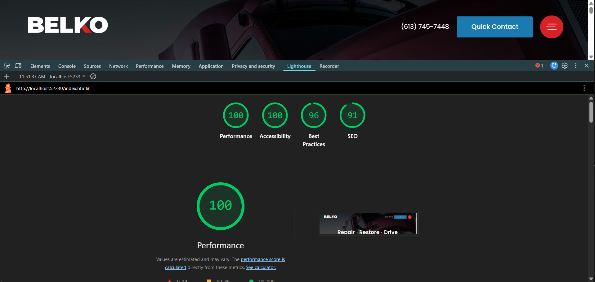

# Belko PSD Rebuild – Frontend Progress

This project is a hand-coded rebuild of the Belko Auto Body PSD design, focusing on responsive layout, visual accuracy, and clean frontend structure.

## Overview
The goal of this rebuild was to closely replicate the provided design while demonstrating practical frontend skills, including responsive behaviour, layout control, animation, and component reuse.

## Completed Work
- Full hero section rebuilt (title layout, dot separators, responsive line breaking)
- Spinning circular badge with adjusted animation timing
- Primary CTA button alignment and responsive repositioning
- Header layout with responsive visibility rules
- Fixed-position modal menu button with animated hamburger → X transition
- Sliding modal navigation panel with proper layering and state handling
- JavaScript logic for modal open/close interaction
- Location & Reviews vertical tab with hover styling
- Responsive breakpoints implemented (1400, 1050, 950, 900, 825, 775)

## Subpage & Template Implementation
- Built a reusable service subpage template based on the site’s existing page structure
- Implemented a consistent intro layout for service pages
- Created a split media/content section using an offset overlay card to mirror the visual style of the homepage
- Embedded a placeholder drone-style video to demonstrate motion-based layout concepts

### Media Note
The embedded video is a low-quality placeholder (under 10 MB) used strictly to demonstrate layout, positioning, and overlay behaviour. It represents the intended concept (e.g., a shop fly-through) rather than final media quality.

## Modal & Interaction Details
- Offset circular modal trigger recreated and fixed during scroll
- Menu icon animates into an “X” state when active
- Modal layout closely follows the original structure
- Action buttons within the modal were intentionally simplified to demonstrate functionality rather than full feature accessibility.

## Scroll & Layout Behaviour
- A temporary content container was added beneath the hero to allow scroll testing
- The hero scroll CTA links directly to the footer on the homepage (no intermediate sections present)
- Sticky and fixed elements were tested to ensure consistent behaviour during scroll

## Footer Implementation
- Footer built as a shared component across the homepage and subpage
- Two-column layout at larger screen sizes
- Additional responsive adjustments applied at tablet and mobile breakpoints
- Footer stacks into a single-column layout on smaller screens for clarity and readability

## Tech Used
- HTML5  
- CSS3 (Flexbox, media queries, BEM-style class naming)  
- Vanilla JavaScript  
- Google Fonts: *Poppins*  
- Chrome DevTools  

## Performance, Accessibility & SEO

As part of this rebuild, key pages were reviewed using standard frontend validation and auditing tools to ensure performance, accessibility, and SEO best practices were met.

### Lighthouse (Chrome DevTools – Desktop)
#### Homepage
- Performance: 100
- Accessibility: 100
- Best Practices: 96
- SEO: 91

#### Surface Prep Page
- Performance: 100
- Accessibility: 100
- Best Practices: 96
- SEO: 91

*(Scores may vary slightly depending on environment and network conditions.)*

### Validation
- HTML validated using W3C Markup Validation Service
- CSS validated using W3C CSS Validator
- No critical errors or blocking issues detected

## Project Status
✔ Demonstration complete  
✔ Core layout and interaction goals achieved  
✔ No further development planned for this rebuild  

## Notes
_This project was completed as a frontend demonstration and visual rebuild. The current state reflects the intended scope, and no additional features or sections are planned._